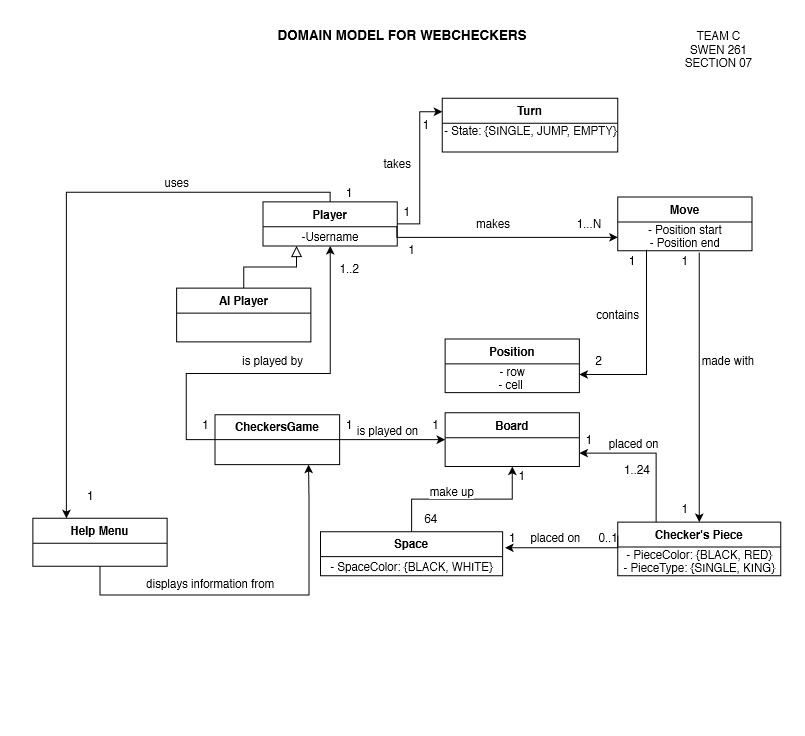
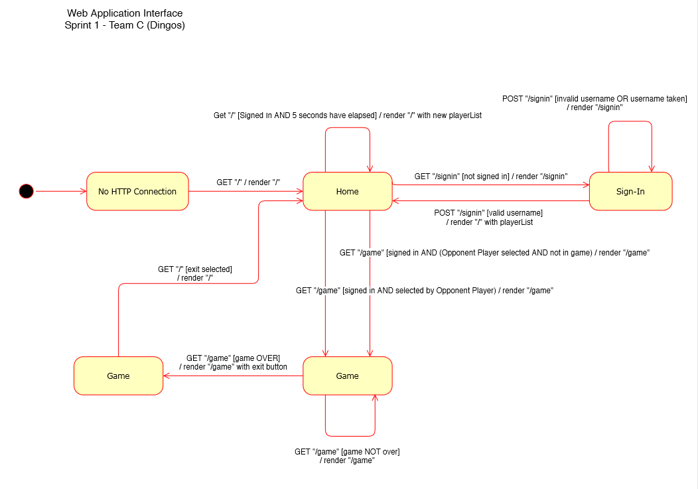
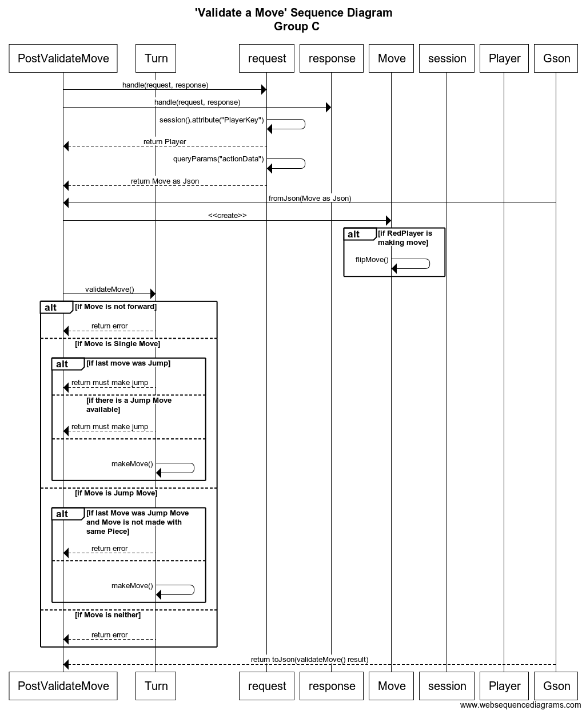
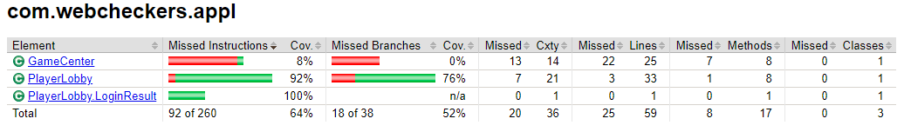
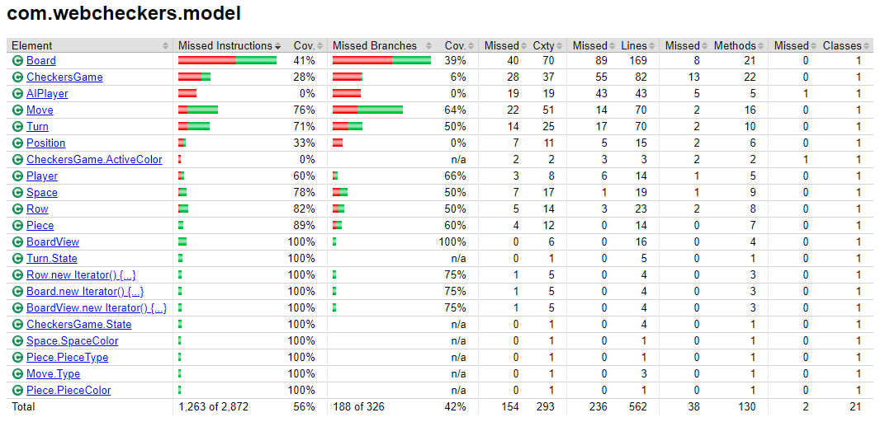
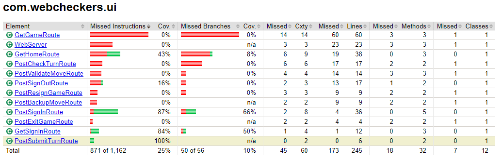
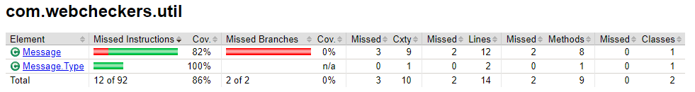

# WebCheckers Project Design Documentation

Updated 4/21/2020

## Team Information
* Team name: C - Dingos
* Team members:
  * Frank Abbey
  * Raisa Hossain
  * Summer DiStefano
  * Stephen Bosonac

## Executive Summary

WebCheckers is a web-based implementation of American checkers.
Users can play a game of checkers with other signed-in players.
This project was built on the Spark web framework in Java 8.

### Purpose

The purpose of this WebCheckers game application is to allow users
to play a game of checkers on a web browser. This game adheres to the
American rules of checkers. 

### Glossary and Acronyms

| Term | Definition |
|------|------------|
| MVP | Minimum Viable Product |
| VO | Value Object |
| UI | User Interface |
| Appl | Application |
| Util | Utility |

## Requirements

This application features a functioning web version of the game Checkers. Players are able to 
sign in with a user name and select from a list of currently logged in users to play a game with. 

The game follows the standard American Checkers rules and features the ability to resign and backup 
your moves before submitting them. 

### Definition of MVP

The minimum viable product (MVP) is defined as a fully functioning game of American Checkers, complete 
with all basic rules and features of a standard Checkers game implemented:

### MVP Features

- Signing in and out of the game
- Piece movement (moving a single piece diagonally, one space)
- Jumping movement (jumping over an opponent's piece in order to capture it)
- King piece functionality
- Ending the game by taking all opponent pieces
- Ending the game by the opponent being unable to make a move
- Resigning from a game 

### Roadmap of Enhancements

- A.I. Player available to chose as opponent
- Help Menu to point out available moves and number of pieces taken*

    *(not implemented)

## Application Domain

The Domain Model represents the relationships and interactions between items
involved with the MVP. The model does not display code-specific classes and structures,
only a high level concept used to understand how a Checkers Game should flow in the
context of a web application.

## Architecture and Design

The application architecture breaks down into 3 main tiers:

1. __UI Tier:__ route handlers, classes that handle requests and responses

2. __Appl Tier:__ logical flow of the application

3. __Model Tier:__ business logic of the domain

### Summary

As a web application, the user interacts with the system using a
browser.  The client-side of the UI is composed of HTML pages with
some minimal CSS for styling the page.  There is also some JavaScript
that has been provided to the team by the architect.

The server-side tiers include the UI Tier that is composed of UI Controllers and Views.
Controllers are built using the Spark framework and View are built using the FreeMarker framework.  The Application and Model tiers are built using plain-old Java objects (POJOs).

Details of the components within these tiers are supplied below.

### Overview of User Interface

The User interface/experience begins at the __home page__ ("/"). Here the User is presented with the
number of other Users currently signed onto the system. From there, the User can click __sign-in__
to be taken to the __sign-in page__ ("/signin"). The User will be presented with a text field to enter
a __username__, and upon successful submission will be re-directed back to the __home page__. If their
username is deemed invalid, they are notified and remain on the __sign-in page__.

Once a User is signed in, they are presented with the same list of other User's signed in, only
now the their user names are displayed. Each username is now a link to commence a game with that
User. If one is clicked on, both Users are directed to the __game page__ ("/game") to play a game
together.

Users will remain in the __game page__ until the game has ended.

### UI Tier

The __UI tier__ handles the server-side functionality of the application. The __WebServer__ class handles the 
initialization of the HTTP request handlers. __Application__ level items such as the __GameCenter__ and the __PlayerLobby__
along with the template engine are passed to the various route handlers through their constructors. 

Regarding the process of move validation, the __PostValidateMoveRoute__ pulls the current __Player__ and __Move__ objects from 
the HTTP request. 

The __PostValidateMoveRoute__ then passes the information over to the __Model tier__ class, __Turn__.

### Application Tier

The Application tier contains the logical flow of the application. 

 - __PlayerLobby__

    Important mostly in handling the logic of Player sign in, the PlayerLobby keeps a list of currently logged in users. 
This class also handles username verification and Player retrieval. 

- __GameCenter__

    This class is used heavily during game play. It contains the list of all active CheckersGames and can determine if a 
player is in a particular game (a very crucial part of the domain logic). 

### Model Tier

The Model tier of the application contains the underlying business logic of the domain classes. Items such as move
validation, removing a piece after a jump move, and turning a piece into a King all happen within these classes.  

### Design Improvements

Some game logic was consolidated. In designing the __AI Player__ taking their turn, originally the game logic resided in 
the __GetGameRoute__, but was later handed off completely to the __AIPlayer__ class.

Future improvements to the project include:
- More advanced AI
- Help Menu
- Easier to follow application flow   

## Testing

### Acceptance Testing

All acceptance criteria have been tested and passed. 

Our only concern was that the player that Resigned from a game is redirected to their Home page, but this might be a 
feature of the front end code.  

### Unit Testing and Code Coverage

For unit testing, first we wanted to tackle a class from every tier in order to have a mold we could follow when 
creating other unit tests for classes within that same tier. 

After that, we targeted classes that were used heavily during Sprint 2 of the project. We wanted to make sure that the
most non-trivial pieces of these classes were being tested properly. 

In Sprint 3, we wanted to tackle more crucial Unit Tests, and get as many done as we could in the time allotted. 

The total coverage of our unit tests is still relatively low, as we are missing coverage in highly used areas of the application. 

## Code Coverage Reports

### Application Tier Coverage

### Model Tier Coverage

### UI Tier Coverage

### Util Tier Coverage

